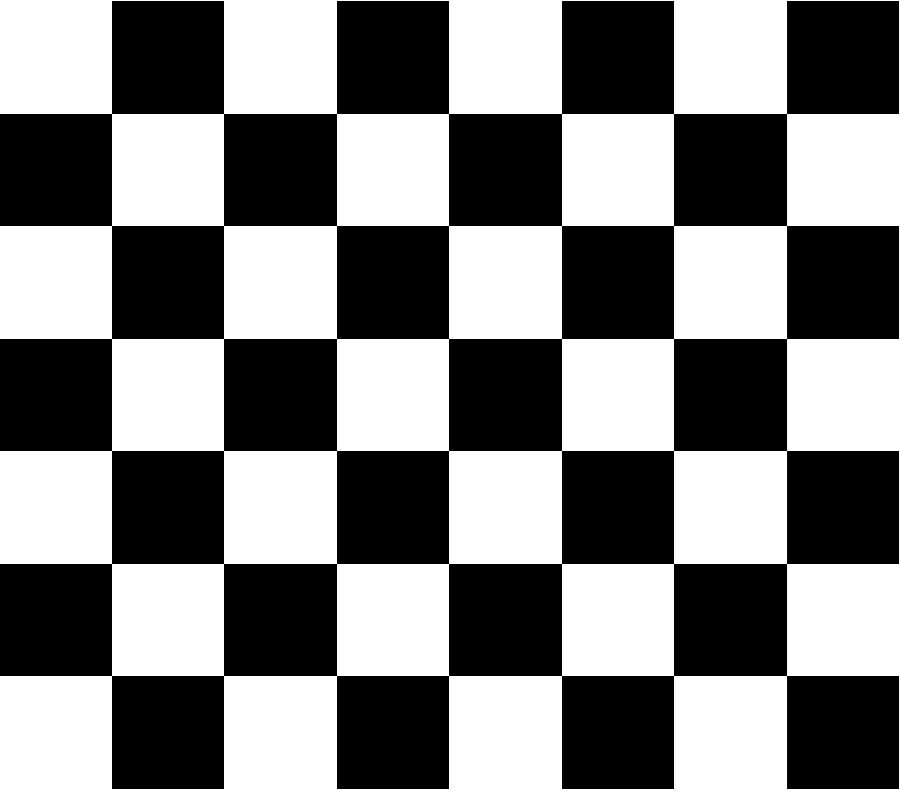

# CSS - Table de Ajedrez.

A partir de la imagen proporcionada, debes escribir código `CSS` necesario para lograr que el documento tenga el mismo aspecto visual, utilizando exclusivamente etiquetas `
` en la estructura `HTML`.

*Ayuda*:

- `Cuadrado negro y blanco` :  100 x 100 pixeles.
- `filas` : *display - flex* y un ancho de 800 pixeles con un alto de 100 pixeles.

